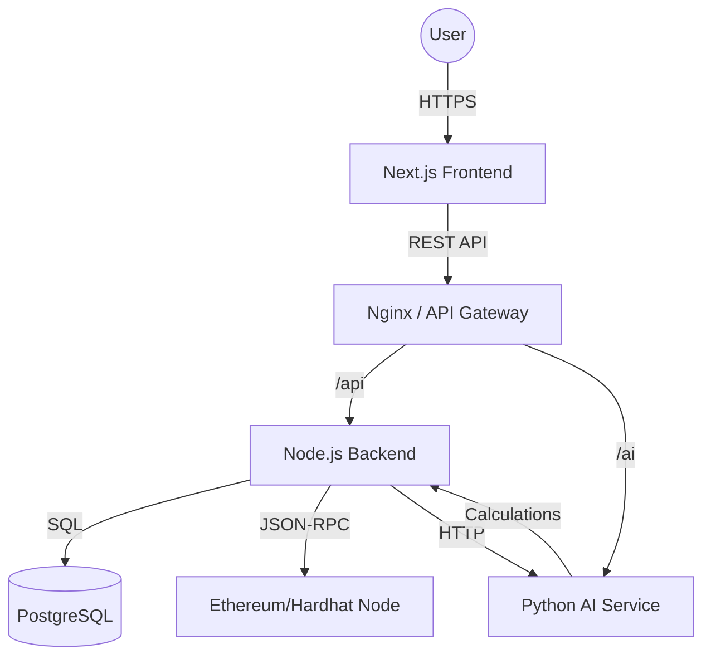

# System Architecture: Anti-Corruption Government Contractor Platform

## Microservices Overview

The system is designed as a secure, distributed microservices architecture.

Please install the Mermaid VS Code extension or view on GitHub to see the diagram.

## Secure Communication Model
1.  **TLS/SSL**: All external communication is encrypted via HTTPS.
2.  **Internal Network**: Services run within a private Docker network, not exposed to the public internet except via the Gateway.
3.  **JWT Auth**: Service-to-service communication is secured or restricted by network policies. Valid JWTs required for all user actions.
4.  **API Rate Limiting**: Implemented at the Gateway and Application level (Express Middleware) to prevent DoS.

## Scalability Strategy
-   **Horizontal Scaling**: Frontend and Backend are stateless and can be scaled horizontally behind a Load Balancer (AWS ALB).
-   **Database**: PostgreSQL can use Read Replicas for high read throughput.
-   **AI Service**: CPU-intensive tasks can be offloaded to a worker queue (Redis/Celery) if load increases.
-   **Blockchain**: Uses a permissioned Layer 2 or Sidechain (e.g., Polygon Edge or Hyperledger Besu) for high throughput and low cost, anchoring state to Ethereum Mainnet for security.

## Deployment Plan (Docker + AWS)

### Docker Containers
-   `frontend`: Next.js application.
-   `backend`: Node.js Express API.
-   `ai-service`: Python FastAPI.
-   `db`: PostgreSQL.
-   `blockchain`: Hardhat node (for dev/test) or Geth node.

### AWS Infrastructure
-   **ECS/EKS**: Orchestrate containers.
-   **RDS**: Managed PostgreSQL.
-   **S3**: Store large files (encrypted), with IPFS hashes stored on-chain.
-   **KMS**: Manage encryption keys for secrets.
